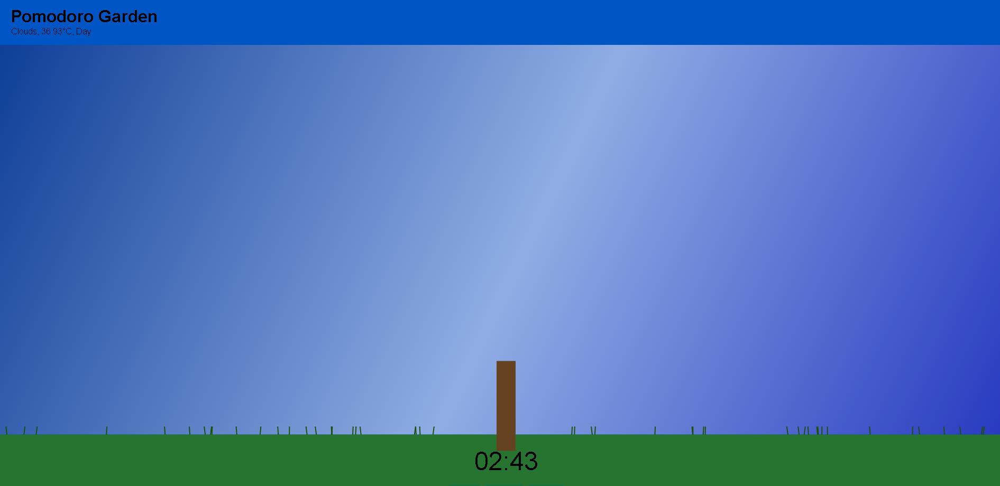

# Pomodoro_Garden
Pomdoro Garden is a pomdoro focus website where a procedural fractal tree is grown on an html canvas in sync with your timer, and reacts with real weather via the OpenWeatherMap API, and wilts if you switch tabs mid-session.

Playable Link: https://pln3appl3.github.io/Pomodoro_Garden/

